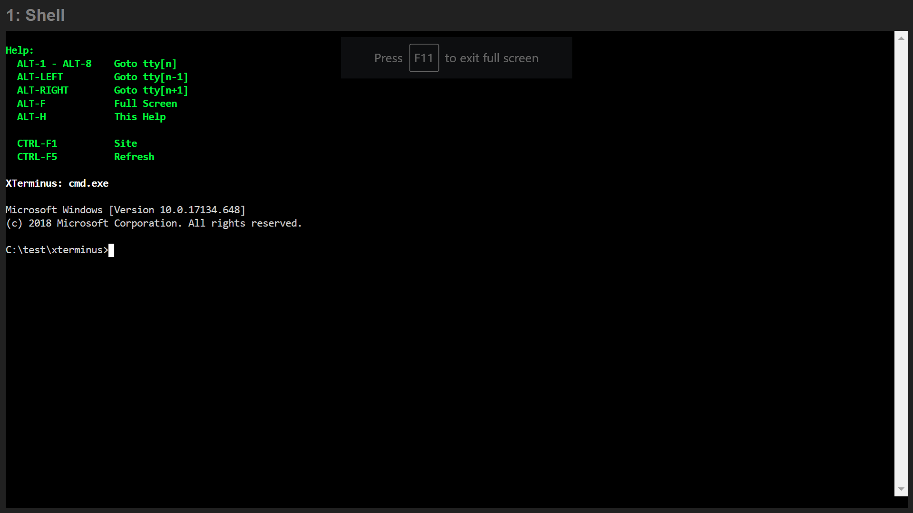

## XTerminus

### Purpose
XTerminus provides a means to run several configurable terminals in the browser. The primary use case is to provide watch support more complex NPM-oriented projects.
### Building
Nothing to do.
### Building for Docker
`$ npm run build:docker`
### Running
`$ npm run server`
OR
`$ node server`
### Configuration Files
` ./.xterminus.json`
` ../.xterminus.thisdir.json`
### Site Directory
` ./.site`
### Environment Variables
`XTERMINUS_PORT=13080`
### Configuration Schema
```
{
    "shell": {
        "title": "Shell"
    },
    "tty2": {
        "title": "Server (jest)",
        "cwd": "server",
        "npm": "test:watch"
    },
    "tty3": {
        "title": "Server (tsc)",
        "cwd": "server",
        "npm": "compile:watch"
    },
    "tty4": {
        "title": "Server",
        "spawn": "node",
        "args": [
            "--inspect",
            "server/index.js"
        ],
        "watch": [
            "server/**/*.js"
        ]
    },
    "tty5": {
        "title": "Designer",
        "cwd": "designer",
        "npm": "start"
    }
}
```
